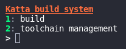

# Katta

an updated build script to replace the old Infinitime builder script

* requires `wget, wheel, cbor, intelhex, adafruit-nrfutil cryptography, mcuboot` via `pip` 
* features new terminal-ui interface
* more features planned ahead..

- [x] support for `x64` and `aarch64` linux environments for building
- [ ] support for win32 environment for building
- [ ] support for macOS environment for building
